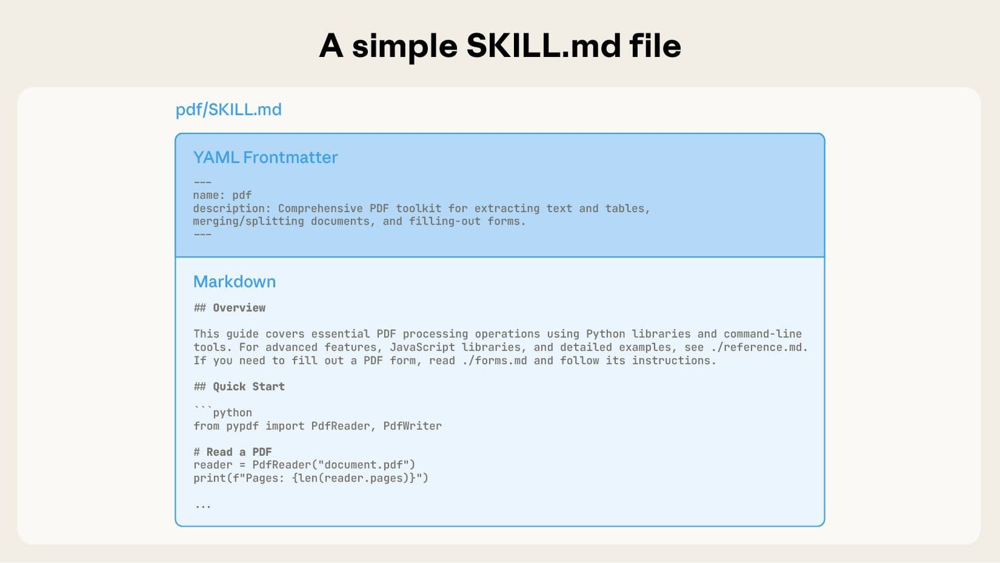

# SKILL에 대해 알아보자

## SKILL

> SKILL.md는 “AI가 특정 작업을 더 잘 수행하도록 알려주는 작업 설명서”. 
> AI에게 언제 이 스킬을 써야 하는지, 어떤 절차로 일해야 하는지, 어떤 파일을 참고해야 하는지 알려주는 운영 매뉴얼. 



- [Skills overview for agents - Copilot Studio](https://learn.microsoft.com/en-us/microsoft-copilot-studio/agents-experience/skills-overview)
- [Create skills for agents - Copilot Studio](https://learn.microsoft.com/en-us/microsoft-copilot-studio/agents-experience/skills-create)
- [Agent Skills](https://agentskills.io/home)

Skill은 Copilot Studio에서 에이전트가 특정 작업을 수행하도록 돕는 **지침의 집합체** 입니다. (Markdown 파일 형식) 에는 에이전트가 언제 어떤 일을 해야 하는지, 어떤 정보를 참고해야 하는지, 어떤 절차로 처리해야 하는지가 들어 있습니다. 그래서 Skill을 사용하면 에이전트가 정해진 목적에 맞게 더 일관되게 동작할 수 있습니다.

## SKILL.md 읽어보기 

아래는 문서 요약 작업을 위한 실제 SKILL.md 예시입니다.

```markdown
---
name: document-summary
description: 긴 문서를 핵심만 간단하게 요약한다.
---

# 문서 요약 스킬

## 목적

사용자가 제공한 문서의 핵심 내용을 짧고 정확하게 요약한다.

## 언제 사용하나

- 긴 문서를 빠르게 이해해야 할 때
- 회의록, 보고서, 안내문에서 핵심만 뽑아야 할 때

## 핵심 지침

- 원문에 없는 내용을 추가하지 않는다.
- 중요한 내용부터 먼저 정리한다.
- 요약은 짧고 명확하게 작성한다.

## 작업 절차

1. 문서의 제목과 구조를 먼저 확인한다.
2. 핵심 문장과 반복되는 내용을 찾는다.
3. 핵심만 남겨 3~5줄 정도로 요약한다.

## 출력 형식

- 한 줄 요약
- 핵심 포인트 3개
- 필요하면 다음 행동 제안

## 예시

### 입력 예시

긴 회의록 또는 안내 문서

### 출력 예시

이 문서는 프로젝트 일정과 역할 분담을 설명한다.
핵심은 마감일 준수, 담당자 확인, 주간 점검이다.
다음 단계는 담당자별 작업 목록을 정리하는 것이다.

## 주의사항

- 민감한 정보는 그대로 노출하지 않는다.
- 사용자가 원하지 않으면 추측해서 보완하지 않는다.
```

- Skill은 전체 Markdown을 한꺼번에 로드 하는 것이 아니라, **name과 description만 먼저 로드** 하고, 실제 작업이 필요할 때 나머지 내용을 로드합니다. 따라서 Skill.md 파일은 name과 description을 먼저 작성하고, 이후에 목적, 절차, 출력 형식 등을 작성하는 것이 좋습니다. 
- Skill의 name은 소문자 및 - (하이픈)으로 구성해야 합니다. (예: document-summary, data-cleaning)
- Skill의 description은 에이전트가 어떤 작업을 수행하는지 한 줄로 요약한 내용으로, 에이전트가 Skill을 선택할 때 가장 먼저 확인하는 정보입니다. 따라서 description은 간결하고 명확하게 작성해야 합니다. 과거 Classic Bot의 Topic의 Trigger Phrase와 유사한 역할을 합니다.
- YAML Frontmatter 아래의 본문은 실제로 SKill이 수행할 작업에 대한 지침을 작성하는 곳입니다. 에이전트가 어떤 상황에서 어떤 작업을 수행해야 하는지, 어떤 정보를 참고해야 하는지, 어떤 절차로 처리해야 하는지 등을 상세히 작성합니다.

## SKILL FAQ

### SKILL.md랑 그냥 프롬프트랑 뭐가 달라요? 
- 프롬프트는 보통 한 번 쓰는 지시문이고, SKILL.md는 반복적으로 재사용되는 작업 지침입니다. 

### SKILL.md 하나만 있으면 되나요? 
- 간단한 스킬은 하나만 있어도 됩니다.하지만 복잡한 스킬은 보통 추가 파일을 둡니다. SKill Bundle & 단일 SKill 에서 해당 내용을 다룹니다. 
