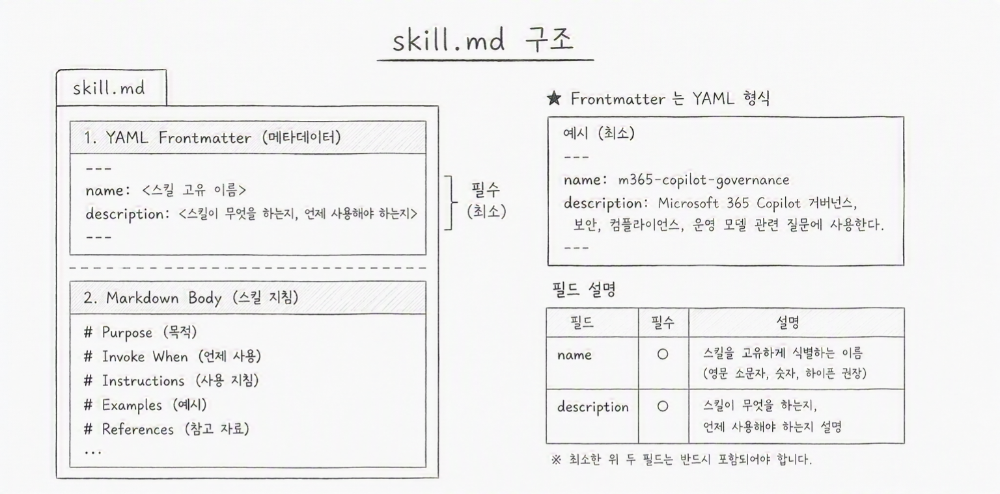

# SKILL.md를 작성해보자

## SKILL.md 의 구조 



## SKILL.md 기본 템플릿

```markdown
---
name: skill-name
description: 이 스킬이 해결하는 문제를 한 줄로 설명한다.
---

# Skill Name

## 목적

이 스킬의 목표를 짧게 설명한다.

## 언제 사용하나

- 어떤 상황에서 이 스킬을 호출해야 하는지 적는다.
- 어떤 요청 키워드가 들어오면 적합한지 적는다.

## 입력 정보

- 사용자에게서 필요한 정보
- 작업 전에 확인할 파일/환경

## 작업 절차

1. 현재 상태를 확인한다.
2. 필요한 변경을 적용한다.
3. 결과를 검증한다.

## 출력 형식

- 최종 응답 형식(예: 체크리스트, 코드 블록, 요약)
- 파일/명령어 안내 방식

## 예시

### 입력 예시

사용자 요청 예시를 적는다.

### 출력 예시

원하는 답변 예시를 적는다.

## 주의사항

- 민감정보 처리 규칙
- 하지 말아야 할 동작
```


## 마크다운 문법 

```
# 대제목 
## 중제목 
### 소제목 
> #과 글자 사이 빈 칸이 있어야 적용됨. 
> 인용문 

**굵게**
*기울임*
~~취소선~~

| 제목 1 | 제목 2 |
| --- | --- |
| 내용 1 | 내용 2 | 

```

