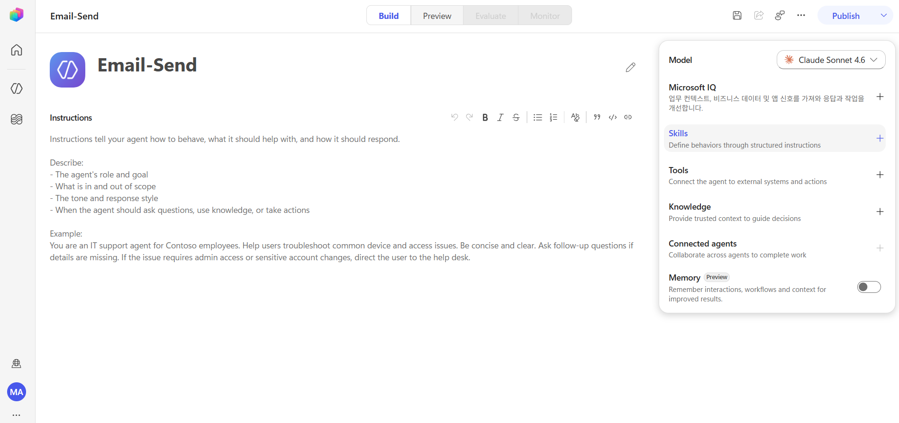
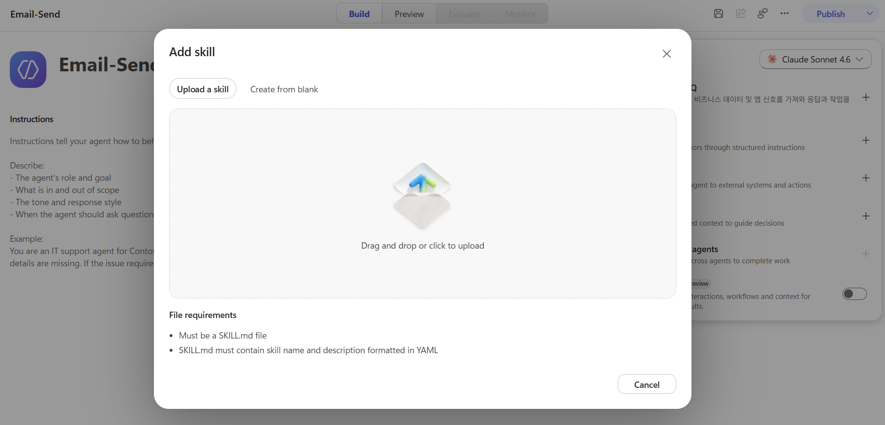
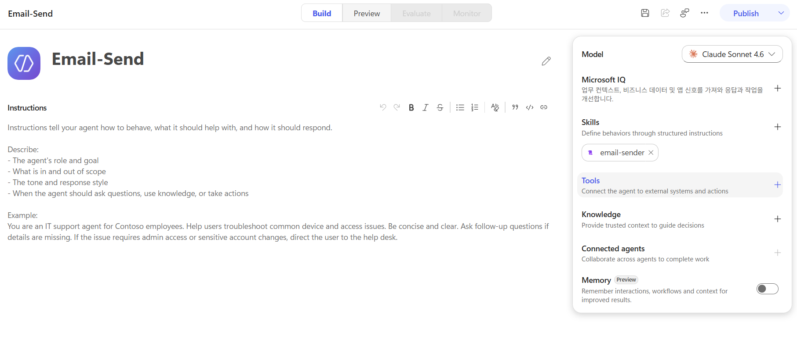
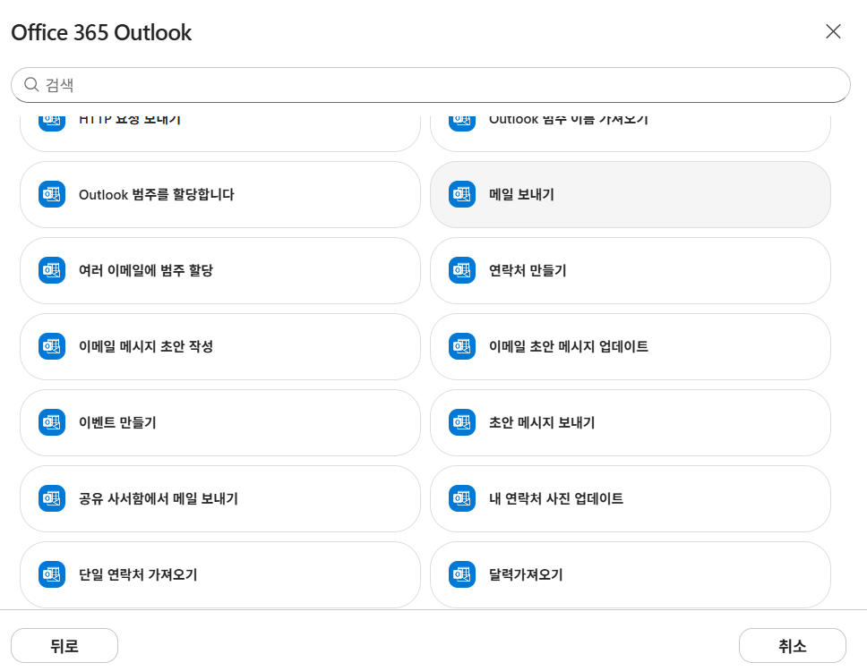

# SKILL.md를 작성해보자

## 마크다운 문법 

마크다운은 텍스트 앞에 기호를 붙여서 제목, 목록, 강조, 인용문 같은 형식을 쉽게 만드는 문법입니다.

### 제목

`#`의 개수로 제목의 크기를 정합니다. `#`이 적을수록 더 큰 제목입니다.

```markdown
# 대제목
## 중제목
### 소제목
```

### 인용문

`>` 기호를 앞에 붙이면 인용문이 됩니다. `>`와 글자 사이에는 공백이 있어야 합니다.

```markdown
> 인용문 예시
```

### 강조

- `**텍스트**` : 굵게 표시
- `*텍스트*` : 기울임꼴 표시
- `~~텍스트~~` : 취소선 표시

```markdown
**굵게**
*기울임*
~~취소선~~
```

### 표

`|` 기호로 열을 나누면 표를 만들 수 있습니다. 첫 줄은 제목, 두 번째 줄은 구분선입니다.

```markdown
| 제목 1 | 제목 2 |
| --- | --- |
| 내용 1 | 내용 2 |
```

## SKILL.md 작성 실습 - Skill 작성 

**간단하게 Outlook 이메일을 작성 및 전송하는 SKILL.md 를 Copilot Studio에서 작성해보겠습니다.**


- Skills 추가 (+) 버튼을 클릭합니다.

<br>


- **Skill을 업로드** 하거나 **Skill을 직접 작성** 할 수 있습니다. 여기서는 직접 작성 (Create from blank) 를 선택합니다. 

```markdown
name : email-sender
description : Outlook 이메일을 작성하고 전송하는 스킬. 사용자가 Outlook을 통해 이메일을 보낼 수 있도록 받는 사람, 제목, 본문을 수집하고, 최종 내용을 확인한 뒤 메일을 발송합니다. 이메일 보낼래, 메일 보내기, 이메일 작성, 이메일 전송 등과 같은 요청에 사용합니다. 
```
<br>

- 지침에는 다음과 같이 작성합니다. 

```markdown
# Outlook 이메일 발송 스킬

## 목적

사용자가 Outlook 이메일을 작성하고 안전하게 발송할 수 있도록 돕습니다.

## 언제 사용하나

- 사용자가 이메일을 보내달라고 요청했을 때
- 사용자가 메일 제목이나 본문 작성을 도와달라고 했을 때
- 사용자가 Outlook을 통해 메일을 전송하려고 할 때

## 필요한 정보

- 받는 사람 이메일 주소
- 메일 제목
- 메일 본문

## 작업 절차

1. 사용자가 이메일 발송을 요청하면 필요한 정보가 모두 있는지 확인합니다.
2. 필수 정보가 부족하면 누락된 내용을 사용자에게 질문합니다.
3. 사용자가 간단한 메모나 핵심 내용만 제공한 경우, 자연스럽고 업무용으로 적절한 이메일 본문으로 다듬습니다.
4. 메일을 보내기 전에는 아래 형식으로 최종 내용을 사용자에게 보여줍니다.

받는 사람:
제목:
본문:

5. 그 다음 "이 내용으로 메일을 보낼까요?"라고 물어 최종 승인을 받습니다.
6. 사용자가 명확하게 승인한 경우에만 `Office 365 Outlook` 커넥터의 `Send an email (V2)` 작업을 실행합니다.
7. 사용자가 수정 요청을 하면 내용을 수정한 뒤 다시 최종 확인을 받습니다.

## 주의사항

- 사용자의 명시적인 승인 없이 절대 메일을 발송하지 않습니다.
- 받는 사람 이메일 주소를 임의로 추측하지 않습니다.
```
### 여기서 잠깐 

여기서 주요하게 살펴볼 부분은 
> 6. 사용자가 명확하게 승인한 경우에만 `Office 365 Outlook` 커넥터의 `Send an email (V2)` 작업을 실행합니다. 

- 이처럼 에이전트가 실제로 호출해서 작업을 수행하는 커넥터나 MCP를 `Tool`이라고 합니다. Tool은 단순한 설명이 아니라, 에이전트가 바깥 시스템과 연결되어 실제 동작을 실행할 수 있게 해주는 실행 수단입니다.

- 예를 들어 `Office 365 Outlook` 커넥터의 `Send an email (V2)`는 메일을 실제로 보내는 Tool입니다. 반대로 Tool이 없으면 에이전트는 메일 작성 방법을 설명하거나 초안을 정리해줄 수는 있어도, Outlook에 접속해서 메일을 실제로 발송하지는 못합니다.

- 즉, Skill은 "어떻게 일할지 알려주는 지침"이고, Tool은 "실제로 행동하게 해주는 실행 수단"이라고 이해하면 됩니다. 

#### 질문 : Tool을 무조건 명시해야 하나요? 

- 스킬에 Tool 사용 방법을 명확히 적어두면 실행 정확도가 높아지고, Tool 자체가 연결되어 있어야 실제 실행이 가능하다는 점에서, Tool을 명시하는 것이 좋습니다. 하지만 스킬에 Tool을 명시하지 않아도, 에이전트가 Tool을 호출할 수 있는 경우에는 Tool을 사용해서 실제 작업을 수행할 수 있습니다. 

<br>

**Skill을 `create` 합니다.** 

<br>



- 여기서 Tool (`Office 365 Outlook` 커넥터의 `Send an email (V2)` 작업)을 연결합니다.



**에이전트를 저장합니다.** 
여기서 우리는 Skill을 만들고, 실제로 실행할 수 있는 Tool을 연결했습니다. 이제 에이전트가 이 Skill을 사용해서 실제로 Outlook 이메일을 작성하고 발송할 수 있습니다. 

## SKILL.md 작성 실습 - 테스트 해보기


