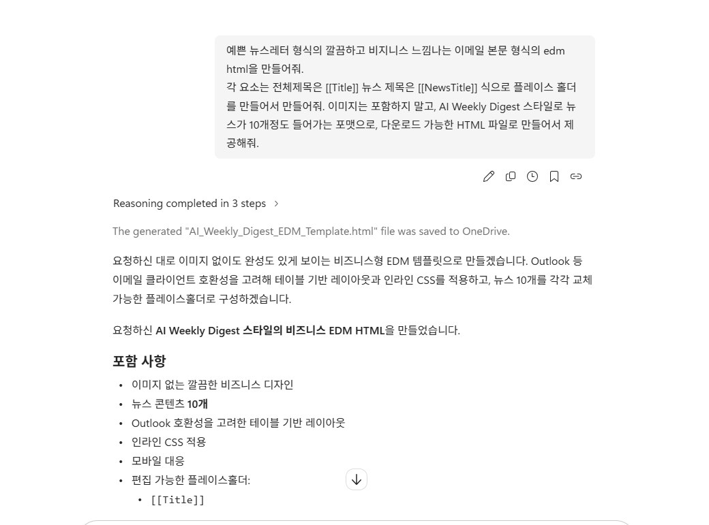
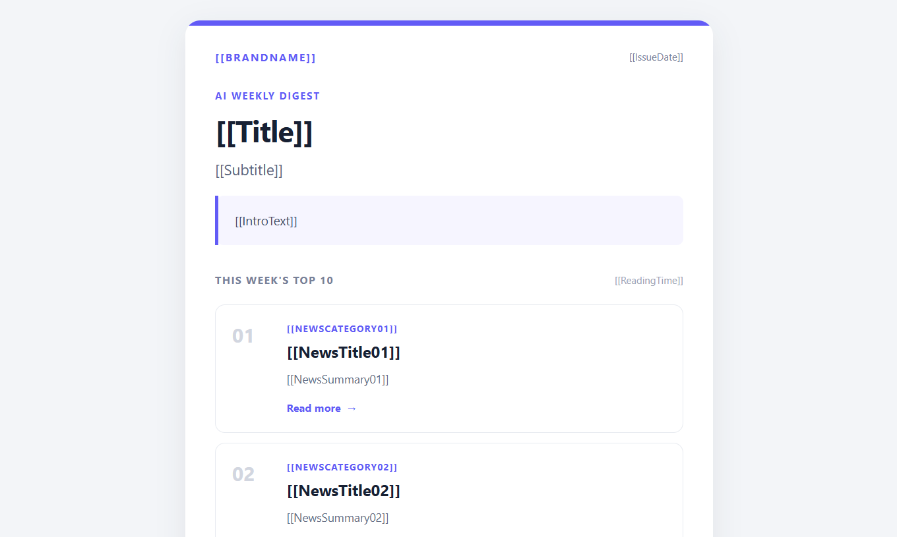
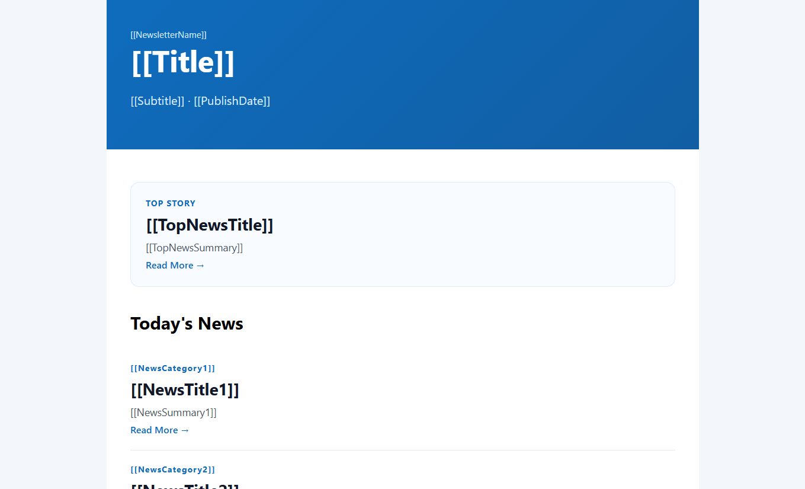

# 실습 1 - Email EDM HTML 생성

## Copilot과 대화로 생성하기

```text
예쁜 뉴스레터 형식의 깔끔하고 비지니스 느낌나는 이메일 본문 형식의 edm html을 만들어줘.
각 요소는 전체제목은 [[Title]] 뉴스 제목은 [[NewsTitle]] 식으로 플레이스 홀더를 만들어서 만들어줘. 이미지는 포함하지 말고, AI Weekly Digest 스타일로 뉴스가 10개정도 들어가는 포맷으로, 다운로드 가능한 HTML 파일로 만들어서 제공해줘. 
```
에서 시작하여 본인이 원하는 형식의 News Letter EDM HTML을 생성합니다. 

### Tip

작성된 Skill의 경우, 10개의 뉴스 리스트를 전제로 하고 있습니다. 따라서 총 10개의 뉴스 제목과 링크를 포함한 HTML을 생성하도록 요청해야 합니다.

 

### 완성 예제 

 
 

## 예제 EMAIL EDM HTML 다운로드 

[ai-newsletter-template.html 다운로드]({{ '/practice1_downloads/ai-newsletter-template.html' | relative_url }})

[ai-newsletter-template-1.html 다운로드]({{ '/practice1_downloads/ai-newsletter-template-1.html' | relative_url }})

### Tip

`ai-newsletter-template-1.html` 파일을 사용하실 경우, SKILL.md에서 `ai-newsletter-template.html` 대신 `ai-newsletter-template-1.html`로 변경하여 사용하시면 됩니다. 
