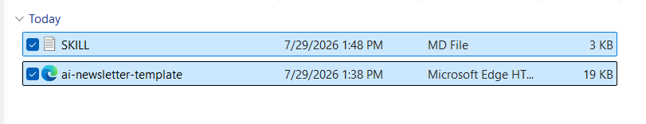
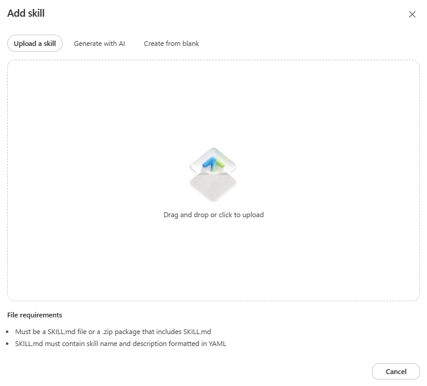
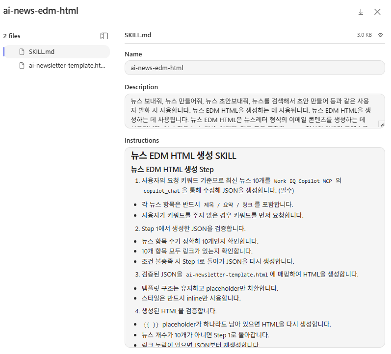
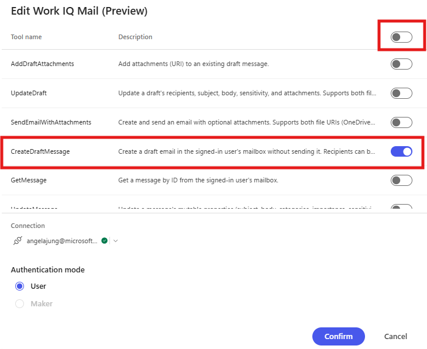
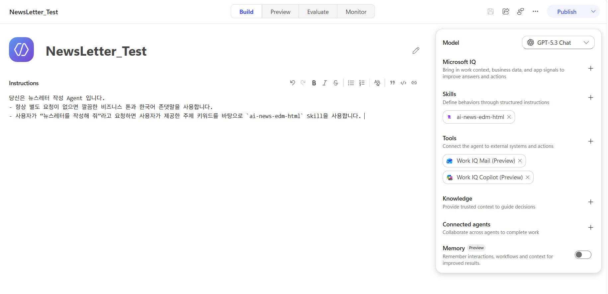
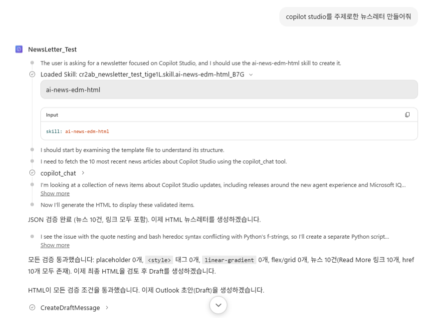
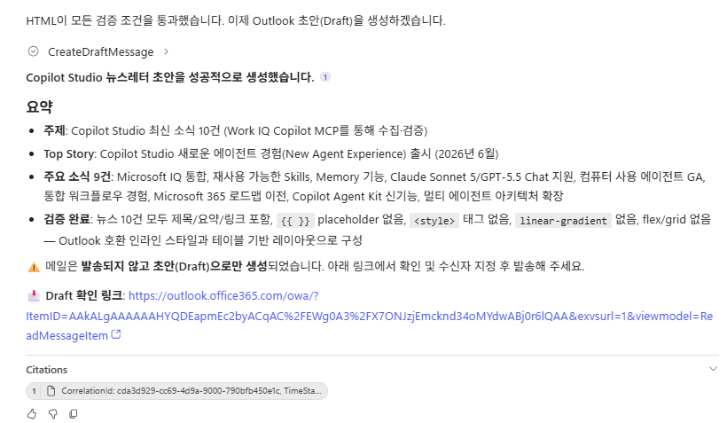
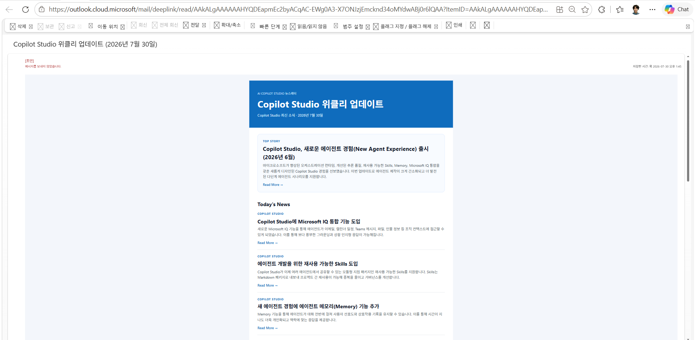

# 실습 2 - Skill 작성하기 (Work IQ MCP 사용 버전)

앞선 실습에서 작성한 reference HTML 파일을 기반으로, 뉴스레터를 생성하는 SKILL.md를 작성해보겠습니다.

`Work IQ Copilot MCP` 의 `copilot_chat`을 통해 뉴스를 수집합니다.
`Work IQ Mail MCP` 의 `CreateDraftMessage`를 통해 뉴스레터 이메일의 Draft를 생성합니다. 

## SKILL.md (초안) 읽어보기

**스킬 초안**

```markdown
---
name : ai-news-edm-html
description : 뉴스 보내줘, 뉴스 만들어줘, 뉴스 초안보내줘, 뉴스를 검색해서 초안 만들어 등과 같은 사용자 발화 시 사용합니다. 뉴스 EDM HTML을 생성하는 데 사용됩니다. 뉴스 EDM HTML은 뉴스레터 형식의 이메일 콘텐츠를 생성하는 데 사용됩니다.
---

# 뉴스 EDM HTML 생성 SKILL

## 뉴스 EDM HTML 생성 Step

1. 사용자의 요청 키워드 기준으로 최신 뉴스 10개를 `Work IQ Copilot MCP` 의 `copilot_chat`을 통해 수집해 목록을 생성합니다. (필수)
  - 각 뉴스 항목은 반드시 `제목 / 요약 / 링크`를 포함합니다.
  - 사용자가 키워드를 주지 않은 경우 키워드를 먼저 요청합니다.

2. Step 1에서 생성한 목록을 검증합니다.
  - 뉴스 항목 수가 정확히 10개인지 확인합니다.
  - 10개 항목 모두 링크가 있는지 확인합니다.
  - 조건 불충족 시 Step 1로 돌아가 목록을 다시 생성합니다.

3. 검증된 목록을 `ai-newsletter-template.html`에 매핑하여 HTML을 생성합니다.
  - 템플릿 구조는 유지하고 placeholder만 치환합니다.

4. 생성된 HTML을 검증합니다.
  - `[[ ]]` placeholder가 하나라도 남아 있으면 HTML을 다시 생성합니다.
  - 뉴스 개수가 10개가 아니면 Step 1로 돌아갑니다.
  - 링크 누락이 있으면 목록부터 재생성합니다.

5. 최종 검증을 통과한 HTML로 `CreateDraftMessage`를 호출해 Draft를 생성합니다. (contentType = HTML)
  - 절대 Send Email 하지 않습니다.
  - 생성된 draft의 webLink를 사용자에게 전달합니다.

```
간단하게 작성한 SKILL.md 초안입니다. 위 SKILL을 기반으로 점차 세부적인 규칙과 검증 로직을 추가하여 최종 스킬을 완성해보세요. 최종 SKILL.md도 위 뼈대에서 크게 달라지지 않습니다. 

## 최종 SKILL.md 로 업데이트 

**스킬 최종본**

```markdown
---
name : ai-news-edm-html
description : 뉴스 보내줘, 뉴스 만들어줘, 뉴스 초안보내줘, 뉴스를 검색해서 초안 만들어 등과 같은 사용자 발화 시 사용합니다. 뉴스 EDM HTML을 생성하는 데 사용됩니다. 뉴스 EDM HTML은 뉴스레터 형식의 이메일 콘텐츠를 생성하는 데 사용됩니다.
---

# 뉴스 EDM HTML 생성 SKILL

## 뉴스 EDM HTML 생성 Step

1. 사용자의 요청 키워드 기준으로 최신 뉴스 10개를 `Work IQ Copilot MCP` 의 `copilot_chat`을 통해 수집해 JSON을 생성합니다. (필수)
  - 각 뉴스 항목은 반드시 `제목 / 요약 / 링크`를 포함합니다.
  - 사용자가 키워드를 주지 않은 경우 키워드를 먼저 요청합니다.
2. Step 1에서 생성한 JSON을 검증합니다.
  - 뉴스 항목 수가 정확히 10개인지 확인합니다.
  - 10개 항목 모두 링크가 있는지 확인합니다.
  - 조건 불충족 시 Step 1로 돌아가 JSON을 다시 생성합니다.
3. 검증된 JSON을 `ai-newsletter-template.html`에 매핑하여 HTML을 생성합니다.
  - 템플릿 구조는 유지하고 placeholder만 치환합니다.
  - 스타일은 반드시 inline만 사용합니다.
4. 생성된 HTML을 검증합니다.
  - `[[ ]]` placeholder가 하나라도 남아 있으면 HTML을 다시 생성합니다.
  - 뉴스 개수가 10개가 아니면 Step 1로 돌아갑니다.
  - 링크 누락이 있으면 JSON부터 재생성합니다.
5. 최종 검증을 통과한 HTML로 `CreateDraftMessage`를 호출해 Draft를 생성합니다. (contentType = HTML)
  - 절대 Send Email 하지 않습니다.
  - 생성된 draft의 webLink를 사용자에게 전달합니다.

## ✅ Outlook-safe 규칙 (매우 중요)

HTML 생성 시 반드시 다음 규칙을 준수하여 Outlook 호환성을 보장합니다:

- **`<style>` 사용 금지** - 외부 스타일 태그 절대 불가
- **모든 스타일은 inline으로 작성** - 모든 CSS는 태그의 `style=""` 속성에 직접 작성
- **`background: linear-gradient` 사용 금지** - 단색 배경만 사용 (예: `#0f6cbd`)
- **flex / grid 사용 금지** - `<table>` 기반 레이아웃만 사용
- **margin 최소화** - `margin` 대신 `padding` 우선 사용

## 검증 규칙 

- 아래 조건 하나라도 실패하면 HTML 재생성:
  1. [[ ]] 남아있음 ❌
  2. 뉴스 개수 < 10 ❌
  3. inline 스타일 없음 ❌
  4. 링크 누락 ❌
  5. `<style>` 태그 포함 ❌
  6. `linear-gradient` 사용 ❌
  7. `flex` 또는 `grid` 사용 ❌
  8. `margin` 과다 사용 (padding 미사용) ❌

## 재시도 루프 규칙 (필수)

- `[[ ]]`가 남아 있으면 Step 3부터 다시 생성합니다.
- 뉴스가 10개가 아니면 Step 1부터 다시 시작합니다.
- JSON 검증 실패(링크 누락/개수 불일치) 시 Step 1로 돌아갑니다.

```
### Tip 

Vscode 와 같은 코드 작성기가 아닌 메모장에서 Skill을 작성하는 경우, 
 "파일 > 새 마크다운 탭" 선택 후 Skill을 작성, **"SKILL" 이라는 이름으로 저장 합니다.** 
 
## SKILL.zip 생성 및 업로드 



해당 Skill 번들에 필요한 html 레퍼런스 파일과 SKILL.md 파일을 선택하여 Zip Compress 합니다. 여기서 다시 한 번 Skill 내부에 적힌 html 레퍼런스 파일의 이름과 실제 파일의 이름이 동일한지, SKILL 로 대문자로 파일이 저장되어 있는지 등을 확인합니다. 

## SKILL.zip 다운로드

[newsletter-html-email.zip 다운로드]({{ '/practice1_downloads/newsletter-html-email.zip' | relative_url }})

## Agent 생성 및 지침 작성 

에이전트 지침은 단순하게 작성합니다. 

```markdown
당신은 뉴스레터 작성 Agent 입니다. 

- 항상 별도 요청이 없으면 깔끔한 비즈니스 톤과 한국어 존댓말을 사용합니다. 

- 사용자가 “뉴스레터를 작성해 줘”라고 요청하면 사용자가 제공한 주제 키워드를 바탕으로 `ai-news-edm-html` Skill을 사용합니다. 
```

## Skill.zip 업로드 

이번에는 단일 Skill 이었던 [이메일 SKILL.md 작성](./m1-pratice-3) 과 달리, Skill.zip 번들을 업로드 해야합니다.

Skill > Upload a skill 을 통해 아까 생성한 혹은 다운로드 받은 zip 파일을 그대로 업로드 합니다. 



업로드 시 다음과 같이 Skill이 올라가게 되고, Reference 파일도 확인할 수 있습니다. 이런 식으로 업로드한 에이전트는 Create from blank와 다르게 Copilot Studio UI 안에서는 편집이 불가능합니다. 

 

## Tool 연결 

**Work IQ Copilot MCP :** 단일 Tool을 가진 MCP로, `copilot_chat`만 사용합니다. 

**Work IQ Mail MCP :**
 

위 토글 (전체 선택)을 해제하고, `CreateDraftMessage`만 선택합니다. 

## Agent 전체 모습  

Work IQ MCP 를 활용한 News Letter Agent가 완성되었습니다! 

 
-------------------------------

## 테스트 

 
 

Tool을 정상적으로 호출해 News Letter Draft를 생성하고, 생성된 Draft의 webLink를 사용자에게 전달하는 것을 확인할 수 있습니다.

