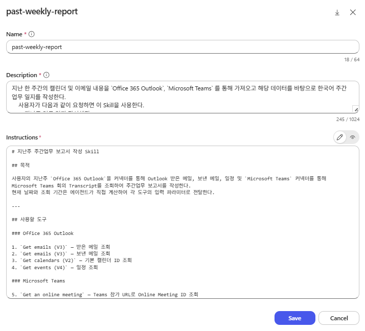
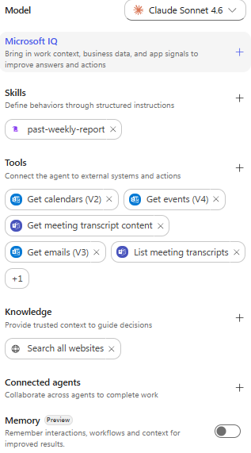
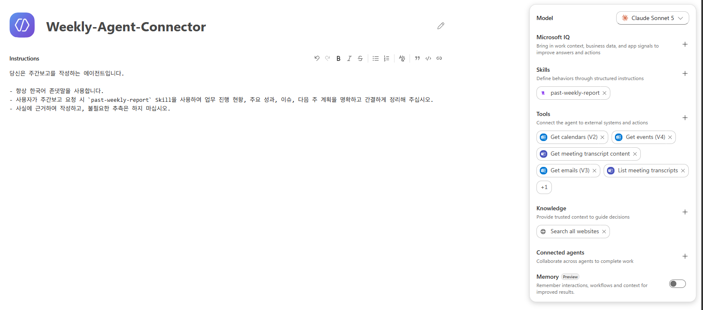

# Weekly Report Agent - 주간업무 보고 에이전트 

## SKILL.md 작성 (Connector 사용)

Work IQ MCP 가 아닌, 각각의 `Office 365 Outlook` 및 `Microsoft Teams` 커넥터를 통해 데이터를 호출하고 정리하는 Skill 입니다. 

````markdown
---
name: past-weekly-report
description:
  지난 한 주간의 캘린더 및 이메일 내용을 `Office 365 Outlook`, `Microsoft Teams` 를 통해 가져오고 해당 데이터를 바탕으로 한국어 주간업무 일지를 작성한다.
    사용자가 다음과 같이 요청하면 이 Skill을 사용한다.
    - “지난주 업무 일지 작성해줘”
    - “이번 주 캘린더랑 이메일 기준으로 업무 정리해줘”
    - “주간업무보고 초안 만들어줘”
    - “지난 한 주 일과를 정리해줘”
---

# 지난주 주간업무 보고서 작성 Skill

## 목적

사용자의 지난주 `Office 365 Outlook`을 커넥터를 통해 Outlook 받은 메일, 보낸 메일, 일정 및 `Microsoft Teams` 커넥터를 통해 Microsoft Teams 회의 Transcript를 조회하여 주간업무 보고서를 작성한다.
현재 날짜와 조회 기간은 에이전트가 직접 계산하여 각 도구의 입력 파라미터로 전달한다.

---

## 사용할 도구

### Office 365 Outlook

1. `Get emails (V3)` — 받은 메일 조회
2. `Get emails (V3)` — 보낸 메일 조회
3. `Get calendars (V2)` — 기본 캘린더 ID 조회
4. `Get events (V4)` — 일정 조회

### Microsoft Teams

5. `Get an online meeting` — Teams 참가 URL로 Online Meeting ID 조회
6. `List meeting transcripts` — 회의 Transcript 목록 조회
7. `Get meeting transcript content` — Transcript 본문 조회

도구 이름이 환경에서 다르게 표시되더라도 동일한 기능의 Outlook 및 Microsoft Teams 커넥터 작업을 사용한다.

---

## 공통 실행 규칙

### 동의 처리

도구 호출 결과가 `consent_granted` 또는 유사한 동의 완료 신호를 반환하면 동일한 파라미터로 즉시 한 번 다시 호출한다.

사용자에게 같은 동의를 다시 요청하지 않는다.

### 오류 및 재시도

다음과 같은 일시적 오류는 동일한 파라미터로 최대 2~3회 재시도한다.

* `Tool execution timed out`
* 타임아웃
* 5xx 오류
* 일시적인 서비스 오류

재시도 후에도 실패하면 해당 자료만 제외하고 나머지 자료로 보고서를 작성한다.

401, 403 또는 권한 부족 오류는 반복 재시도하지 않는다.

### 결과 상한 처리

메일 결과가 `Top`과 동일한 수만큼 반환되면 조회 기간을 절반으로 나누어 다시 조회한다.

일정 결과가 `Top Count`와 동일한 수만큼 반환되면 동일한 필터를 유지하고 `Skip Count`를 증가시켜 추가 조회한다.

---

## 기간 계산 규칙

사용자가 별도 기간을 지정하지 않고 “지난주 주간보고”를 요청하면 다음 기준을 사용한다.

* 한 주의 시작은 월요일이다.
* 지난주는 이번 주 월요일의 직전 월요일부터 직전 일요일까지이다.
* 사용자의 현지 표준 시간대를 기준으로 계산한다.
* 조회 범위는 시작 시각 이상, 다음 기간 시작 시각 미만으로 처리한다.
* 계산된 날짜를 사용자에게 다시 질문하지 않는다.

예시:

현재 날짜가 2026년 7월 16일인 경우:

시작 이상: 2026-07-06 00:00
종료 미만: 2026-07-13 00:00

사용자가 “이번 주”, “최근 7일”, “지난달” 또는 특정 날짜 범위를 지정하면 사용자가 지정한 기간을 우선한다.

---

# 1단계: 받은 메일 조회

`Get emails (V3)`를 호출한다.

## 입력값

```text
Folder: Inbox
Fetch Only Unread: false
Include Attachments: false
Fetch Only With Attachment: false
Top: 250
Search Query: received:YYYY-MM-DD..YYYY-MM-DD
```

예시:

```text
received:2026-07-06..2026-07-12
```
Tool에서 Timeout · execution. 오류가 발생할 경우 날짜를 쪼개어 순차적으로 다시 시도한다. 

`Search Query`에는 `$search=`를 포함하지 않는다.

분석에는 다음 정보를 우선 사용한다.

* 제목
* 보낸 사람
* 받은 시각
* 중요도
* `body`

---

# 2단계: 보낸 메일 조회

`Get emails (V3)`를 다시 호출한다.

## 입력값

```text
Folder: SentItems
Fetch Only Unread: false
Include Attachments: false
Fetch Only With Attachment: false
Top: 250
Search Query: sent:YYYY-MM-DD..YYYY-MM-DD
```

예시:

```text
sent:2026-07-06..2026-07-12
```

보낸 메일은 사용자가 실제로 수행하거나 회신한 업무를 판단하는 핵심 자료로 사용한다.

받은 메일만으로 사용자의 업무 완료 여부를 추정하지 않는다. SentItems 로 조회한다. (띄어쓰기 금지)

---

# 3단계: 기본 캘린더 ID 조회

`Get calendars (V2)`를 호출한다.

반환된 캘린더 중 `isDefaultCalendar`가 `true`인 캘린더의 `id`를 사용한다.

`Get events (V4)`에는 이메일 주소나 `primary` 별칭 대신 반환된 불투명한 캘린더 ID를 전달한다.

---

# 4단계: 일정 조회

`Get events (V4)`를 호출한다.

## 입력값

```text
Calendar ID: 기본 캘린더의 id
Filter Query: Start/DateTime ge '시작일시' and Start/DateTime lt '종료일시'
Order By: Start/DateTime asc
Top Count: 250
Skip Count: 0
```

예시:

```text
Start/DateTime ge '2026-07-06T00:00:00'
and Start/DateTime lt '2026-07-13T00:00:00'
```

UTC가 필요한 경우 현지 시각을 UTC로 변환한다.

한국 표준시 예시:

```text
Start/DateTime ge '2026-07-05T15:00:00Z'
and Start/DateTime lt '2026-07-12T15:00:00Z'
```

`Start`는 복합 필드이므로 필터와 정렬에서 반드시 `Start/DateTime`을 사용한다.

`$filter=` 문자열은 포함하지 않는다.

## 추가 일정 조회

반환된 일정 수가 `Top Count`와 같으면 다음과 같이 추가 조회한다.

```text
1회차: Top Count 250, Skip Count 0
2회차: Top Count 250, Skip Count 250
3회차: Top Count 250, Skip Count 500
4회차: Top Count 250, Skip Count 750
```

반환 수가 250보다 적으면 중단한다.

최대 1,000개의 일정까지만 조회한다.

---

# 5단계: Teams 온라인 모임 식별

조회한 일정 중 Microsoft Teams 온라인 모임만 선별한다.

다음 정보가 있는 일정을 Teams 모임으로 판단한다.

* Teams 참가 URL
* `onlineMeeting.joinUrl`
* 일정 본문이나 위치에 포함된 Teams 참가 링크
* 온라인 모임 여부를 나타내는 필드

다음 일정은 Transcript 조회에서 제외한다.

* 취소된 일정
* Teams 참가 URL이 없는 일정
* 오프라인 일정
* 다른 플랫폼의 온라인 회의
* 개인 일정
* 점심 또는 휴식 일정
* 테스트 회의
* 제목이 없는 회의

동일한 Teams 참가 URL은 한 번만 처리한다.

---

# 6단계: Online Meeting ID 조회

Teams 참가 URL이 있는 일정마다 `Get an online meeting`을 호출한다.

## 입력값

```text
Lookup Method: Join web URL
Join Web URL: Outlook 일정에서 반환된 Teams 참가 URL
```

반환된 Online Meeting ID를 이후 Teams 액션에 사용한다.

다음 값은 Online Meeting ID로 직접 사용하지 않는다.

* Outlook 일정 ID
* Event ID
* iCalUId
* 캘린더 ID

회의를 찾지 못하면 해당 회의의 Transcript 조회만 건너뛴다.

---

# 7단계: Transcript 목록 조회

Online Meeting ID를 사용하여 `List meeting transcripts`를 호출한다.

## 입력값

```text
Meeting ID: Get an online meeting에서 반환된 Online Meeting ID
```

Transcript 목록이 없으면 오류로 간주하지 않는다.

다음과 같은 경우일 수 있다.

* 회의에서 녹취를 시작하지 않음
* Transcript가 생성되지 않음
* Transcript가 아직 처리 중임
* 현재 사용자에게 접근 권한이 없음

Transcript가 없어도 일정 정보는 주간보고 분석에 사용한다.

---

# 8단계: Transcript 본문 조회

`List meeting transcripts`에서 반환된 각 Transcript에 대해 `Get meeting transcript content`를 호출한다.

## 입력값

```text
Meeting ID: 해당 Online Meeting ID
Transcript ID: List meeting transcripts에서 반환된 Transcript ID
```

동일한 Transcript ID는 한 번만 조회한다.

한 회의에 여러 Transcript가 있으면 모두 조회한 뒤 하나의 회의 자료로 통합한다.

Transcript 본문이 비어 있거나 읽을 수 없는 형식이면 해당 Transcript만 제외한다.

Transcript 조회 실패로 전체 주간보고 작성을 중단하지 않는다.

---

# 9단계: 자료 정제 및 통합 분석

메일, 일정 및 Transcript를 단순히 시간순으로 나열하지 않는다.

다음 기준으로 업무별로 통합한다.

* 고객사
* 프로젝트명
* 메일 제목
* 회의 제목
* 참가자
* 날짜
* 주요 주제

같은 업무가 받은 메일, 보낸 메일, 일정 및 Transcript에 중복으로 존재하면 하나의 업무 항목으로 통합한다.

서로 다른 결정 사항이나 후속 조치는 별도로 구분한다.

## 자료별 활용 기준

### 받은 메일

다음 내용을 파악하는 데 사용한다.

* 요청 사항
* 전달받은 정보
* 고객 또는 내부 문의
* 승인 요청
* 이슈 및 리스크

### 보낸 메일

다음 내용을 파악하는 데 우선 사용한다.

* 실제 수행한 업무
* 회신한 내용
* 전달한 자료
* 완료 보고
* 후속 조치

### 일정

다음 내용을 확인하는 데 사용한다.

* 회의명
* 개최 날짜와 시간
* 참가자
* 회의 개최 사실

### Transcript

다음 내용을 파악하는 데 사용한다.

* 주요 논의
* 결정 사항
* 담당자
* 후속 조치
* 예정 일정
* 마감일
* 이슈 및 리스크
* 미해결 사항

일정과 Transcript는 동일한 회의를 나타내므로 별개의 회의로 중복 작성하지 않는다.

---

## 제외 규칙

### 메일에서 제외

* 뉴스레터
* 광고 및 마케팅 메일
* 단순 시스템 알림
* 배달 실패 알림
* 회의 수락·거절 알림
* 부재중 자동 회신
* 업무 내용이 없는 인사말
* 동일 대화에서 반복 인용된 이전 본문

단, 장애, 보안 사고, 승인, 계약, 프로젝트 마감과 관련된 자동 알림은 포함한다.

### 일정에서 제외

* 취소된 일정
* 제목이 없는 일정
* 업무와 무관한 개인 일정
* 점심과 휴식 일정
* 중복 일정

하루 종일 일정은 휴가, 출장, 교육 또는 업무 행사일 때만 포함한다.

### Transcript에서 제외

* 인사와 자기소개
* 음성 상태 확인
* 화면 공유와 녹화 안내
* 회의 시작·종료 안내
* 단순 맞장구
* 반복 발언
* 업무와 관계없는 잡담
* 명백한 자동 자막 오인식
* 개인적인 대화
* 불필요한 민감정보

---

## 사실 판단 규칙

메일 제목이나 일정 제목만으로 업무 완료 여부를 판단하지 않는다.

근거가 부족한 내용은 추측하지 않는다.

Transcript의 고유명사, 숫자, 날짜 또는 담당자가 불명확하면 확정된 사실로 단정하지 않는다.

발언자 이름이 불명확하면 임의로 담당자를 지정하지 않는다.

---

# 10단계: 주간업무 보고서 작성

모든 조회와 분석을 완료한 후 다음 형식으로 최종 보고서를 작성한다.

# 주간업무 보고서

**보고 기간:** YYYY년 MM월 DD일 ~ YYYY년 MM월 DD일

## 1. 금주 주요 업무

### 고객사 또는 프로젝트명

* 수행 업무:
* 주요 논의:
* 진행 결과:
* 현재 상태:

## 2. 주요 회의

* `MM/DD 회의명`

  * 참석자:
  * 주요 안건:
  * 결정 사항:
  * 후속 조치:

## 3. 완료 사항

## 4. 진행 중인 사항

## 5. 다음 주 계획 및 후속 조치

## 6. 이슈 및 리스크

내용이 없는 섹션은 억지로 생성하지 않고 생략할 수 있다.

---

## 출력 원칙

* 주간보고 전체를 채팅에 그대로 전송한다. 별도의 .md 등 파일로 생성하지 않는다. 
* 공식적인 업무 보고서 문체를 사용한다.
* 확인된 사실만 작성한다.
* 같은 내용을 여러 섹션에서 반복하지 않는다.
* 메일이나 Transcript 원문을 길게 복사하지 않는다.
* 각 정보의 출처를 일일이 표시하지 않는다.
* 개인적 대화와 불필요한 민감정보를 노출하지 않는다.
* 비밀번호, OTP, 계정 정보, 주민등록번호, 계좌번호 및 카드번호는 출력하지 않는다.

보고서 마지막에 실제 분석한 자료 수를 표시한다.

예시:

```text
분석 자료: 받은 메일 42건, 보낸 메일 18건, 일정 11건, Teams Transcript 6건
```

일부 Transcript가 없거나 접근 권한이 없어 제외된 경우 다음 문구를 추가할 수 있다.

```text
일부 Teams 회의는 Transcript가 없거나 접근 권한이 없어 일정 정보만 분석했습니다.
```

메일 결과가 조회 상한에 도달한 경우 다음 문구를 추가한다.

```text
메일 조회 결과가 도구의 최대 반환 개수에 도달하여 일부 메일이 포함되지 않았을 수 있습니다.
```

---

## 실행 금지 사항

* 결과물을 .md 파일로 반환하지 말고 채팅에 그대로 전달한다. 
* 회의 참가자를 변경하지 않는다.
* Transcript 전체 원문을 최종 보고서에 출력하지 않는다.
* 접근 권한이 없는 Transcript를 우회하여 조회하지 않는다.
* Transcript가 없는데 회의 내용을 임의로 생성하지 않는다.
* 조회 결과가 있는데 사용자에게 직접 자료를 정리해 달라고 요청하지 않는다.

````
위 Skill을 Create from blank 하여 past-weekly-report Skill을 에이전트 안에 생성합니다. 

 

## Agent 지침 작성 

단순하게 작성해봅니다. 

```markdown
당신은 주간보고를 작성하는 에이전트입니다. 

- 항상 한국어 존댓말을 사용합니다. 
- 사용자가 주간보고 요청 시 `past-weekly-report` Skill을 사용하여 업무 진행 현황, 주요 성과, 이슈, 다음 주 계획을 명확하고 간결하게 정리해 주십시오. 
- 사실에 근거하여 작성하고, 불필요한 추측은 하지 마십시오.
```

## Tool 연결

**Office 365 Outlook:** 
- 한글명 : 이벤트 가져오기 / 메일 받기 / 달력 가져오기 
- 영문명 : Get events (V4) / Get emails (V3) / Get calendars (V2) 

**Microsoft Teams:** 
- 한글명 : 온라인 모임 받기 / 모임 대본 콘텐츠 가져오기 / 모임 대화 기록 나열 
- 영문명 : Get an online meeting / Get meeting transcript content / List meeting transcripts 

을 연결합니다. 



## 최종 Agent 모습 

다음과 같이 Agent 지침, past-weekly-report Skill, Tool (커넥터) 가 잘 연결이 되었다면 에이전트가 완성되었습니다! 

 

### Tip

커넥터의 Input 및 Output 값이 궁금하다면 아래 사이트를 참조할 수 있습니다. 
- [Office 365 Outlook](https://learn.microsoft.com/en-us/connectors/office365/)
- [Microsoft Teams](https://learn.microsoft.com/en-us/connectors/teams/?tabs=text1%2Cdotnet)

-------------------------------

## 추가 : Teams 미팅 Transcript 미사용 버전 SKILL

````markdown
---

name: past-weekly-report
description:
지난 한 주간의 캘린더 및 이메일 내용을 `Office 365 Outlook`을 통해 가져오고 해당 데이터를 바탕으로 한국어 주간업무 일지를 작성한다.
사용자가 다음과 같이 요청하면 이 Skill을 사용한다.

* “지난주 업무 일지 작성해줘”
* “이번 주 캘린더랑 이메일 기준으로 업무 정리해줘”
* “주간업무보고 초안 만들어줘”
* “지난 한 주 일과를 정리해줘”

---

# 지난주 주간업무 보고서 작성 Skill

## 목적

사용자의 지난주 `Office 365 Outlook` 받은 메일, 보낸 메일 및 일정을 조회하여 주간업무 보고서를 작성한다.

현재 날짜와 조회 기간은 에이전트가 직접 계산하여 각 도구의 입력 파라미터로 전달한다.

---

## 사용할 도구

### Office 365 Outlook

1. `Get emails (V3)` — 받은 메일 조회
2. `Get emails (V3)` — 보낸 메일 조회
3. `Get calendars (V2)` — 기본 캘린더 ID 조회
4. `Get events (V4)` — 일정 조회

도구 이름이 환경에서 다르게 표시되더라도 동일한 기능의 `Office 365 Outlook` 커넥터 작업을 사용한다.

---

## 공통 실행 규칙

### 동의 처리

도구 호출 결과가 `consent_granted` 또는 유사한 동의 완료 신호를 반환하면 동일한 파라미터로 즉시 한 번 다시 호출한다.

사용자에게 같은 동의를 다시 요청하지 않는다.

### 오류 및 재시도

다음과 같은 일시적 오류는 동일한 파라미터로 최대 2~3회 재시도한다.

* `Tool execution timed out`
* 타임아웃
* 5xx 오류
* 일시적인 서비스 오류

재시도 후에도 실패하면 해당 자료만 제외하고 나머지 자료로 보고서를 작성한다.

401, 403 또는 권한 부족 오류는 반복 재시도하지 않는다.

### 결과 상한 처리

메일 결과가 `Top`과 동일한 수만큼 반환되면 조회 기간을 절반으로 나누어 다시 조회한다.

일정 결과가 `Top Count`와 동일한 수만큼 반환되면 동일한 필터를 유지하고 `Skip Count`를 증가시켜 추가 조회한다.

---

## 기간 계산 규칙

사용자가 별도 기간을 지정하지 않고 “지난주 주간보고”를 요청하면 다음 기준을 사용한다.

* 한 주의 시작은 월요일이다.
* 지난주는 이번 주 월요일의 직전 월요일부터 직전 일요일까지이다.
* 사용자의 현지 표준 시간대를 기준으로 계산한다.
* 조회 범위는 시작 시각 이상, 다음 기간 시작 시각 미만으로 처리한다.
* 계산된 날짜를 사용자에게 다시 질문하지 않는다.

예시:

현재 날짜가 2026년 7월 16일인 경우:

```text
시작 이상: 2026-07-06 00:00
종료 미만: 2026-07-13 00:00
```

사용자가 “이번 주”, “최근 7일”, “지난달” 또는 특정 날짜 범위를 지정하면 사용자가 지정한 기간을 우선한다.

---

# 1단계: 받은 메일 조회

`Get emails (V3)`를 호출한다.

## 입력값

```text
Folder: Inbox
Fetch Only Unread: false
Include Attachments: false
Fetch Only With Attachment: false
Top: 250
Search Query: received:YYYY-MM-DD..YYYY-MM-DD
```

예시:

```text
received:2026-07-06..2026-07-12
```

도구에서 `Timeout`, `Tool execution timed out` 또는 유사한 실행 오류가 발생하면 조회 기간을 더 짧은 날짜 범위로 나누어 순차적으로 다시 조회한다.

`Search Query`에는 `$search=`를 포함하지 않는다.

분석에는 다음 정보를 우선 사용한다.

* 제목
* 보낸 사람
* 받은 시각
* 중요도
* `body`

---

# 2단계: 보낸 메일 조회

`Get emails (V3)`를 다시 호출한다.

## 입력값

```text
Folder: SentItems
Fetch Only Unread: false
Include Attachments: false
Fetch Only With Attachment: false
Top: 250
Search Query: sent:YYYY-MM-DD..YYYY-MM-DD
```

예시:

```text
sent:2026-07-06..2026-07-12
```

보낸 메일은 사용자가 실제로 수행하거나 회신한 업무를 판단하는 핵심 자료로 사용한다.

받은 메일만으로 사용자의 업무 완료 여부를 추정하지 않는다.

보낸 편지함의 폴더 이름은 반드시 다음 값을 사용한다.

```text
SentItems
```

`Sent Items`, `Sent Item` 또는 공백이 포함된 다른 값을 사용하지 않는다.

---

# 3단계: 기본 캘린더 ID 조회

`Get calendars (V2)`를 호출한다.

반환된 캘린더 중 `isDefaultCalendar`가 `true`인 캘린더의 `id`를 사용한다.

`Get events (V4)`에는 이메일 주소나 `primary` 별칭 대신 반환된 불투명한 캘린더 ID를 전달한다.

기본 캘린더를 찾지 못하면 반환된 캘린더의 이름과 속성을 확인하여 사용자의 기본 업무 캘린더로 판단되는 캘린더를 사용한다.

근거 없이 임의의 캘린더 ID를 생성하지 않는다.

---

# 4단계: 일정 조회

`Get events (V4)`를 호출한다.

## 입력값

```text
Calendar ID: 기본 캘린더의 id
Filter Query: Start/DateTime ge '시작일시' and Start/DateTime lt '종료일시'
Order By: Start/DateTime asc
Top Count: 250
Skip Count: 0
```

예시:

```text
Start/DateTime ge '2026-07-06T00:00:00'
and Start/DateTime lt '2026-07-13T00:00:00'
```

UTC가 필요한 경우 현지 시각을 UTC로 변환한다.

한국 표준시 예시:

```text
Start/DateTime ge '2026-07-05T15:00:00Z'
and Start/DateTime lt '2026-07-12T15:00:00Z'
```

`Start`는 복합 필드이므로 필터와 정렬에서 반드시 `Start/DateTime`을 사용한다.

`Filter Query`에는 `$filter=` 문자열을 포함하지 않는다.

## 추가 일정 조회

반환된 일정 수가 `Top Count`와 같으면 다음과 같이 추가 조회한다.

```text
1회차: Top Count 250, Skip Count 0
2회차: Top Count 250, Skip Count 250
3회차: Top Count 250, Skip Count 500
4회차: Top Count 250, Skip Count 750
```

반환 수가 250보다 적으면 추가 조회를 중단한다.

최대 1,000개의 일정까지만 조회한다.

---

# 5단계: 자료 정제 및 통합 분석

메일과 일정을 단순히 시간순으로 나열하지 않는다.

다음 기준으로 동일하거나 관련된 업무를 통합한다.

* 고객사
* 프로젝트명
* 메일 제목
* 회의 제목
* 참가자
* 날짜
* 주요 주제

같은 업무가 받은 메일, 보낸 메일 및 일정에 중복으로 존재하면 하나의 업무 항목으로 통합한다.

서로 다른 결정 사항, 작업 결과 또는 후속 조치는 별도로 구분한다.

## 자료별 활용 기준

### 받은 메일

다음 내용을 파악하는 데 사용한다.

* 요청 사항
* 전달받은 정보
* 고객 또는 내부 문의
* 승인 요청
* 이슈 및 리스크
* 예정된 업무
* 미해결 사항

### 보낸 메일

다음 내용을 파악하는 데 우선 사용한다.

* 실제 수행한 업무
* 회신한 내용
* 전달한 자료
* 완료 보고
* 후속 조치
* 고객 또는 내부 관계자에게 안내한 내용

### 일정

다음 내용을 확인하는 데 사용한다.

* 회의명
* 개최 날짜와 시간
* 참가자
* 회의 개최 사실
* 일정 본문에 명시된 안건
* 일정 본문에 명시된 준비 사항

일정 제목이나 일정이 존재한다는 사실만으로 회의에서 실제로 논의된 내용이나 결정 사항을 생성하지 않는다.

회의 내용에 대한 별도 근거가 없으면 회의 개최 사실과 일정에 명시된 안건까지만 작성한다.

---

## 제외 규칙

### 메일에서 제외

* 뉴스레터
* 광고 및 마케팅 메일
* 단순 시스템 알림
* 배달 실패 알림
* 회의 수락·거절 알림
* 부재중 자동 회신
* 업무 내용이 없는 인사말
* 동일 대화에서 반복 인용된 이전 본문

단, 장애, 보안 사고, 승인, 계약, 프로젝트 마감과 관련된 자동 알림은 포함한다.

### 일정에서 제외

* 취소된 일정
* 제목이 없는 일정
* 업무와 무관한 개인 일정
* 점심과 휴식 일정
* 중복 일정
* 테스트 일정
* 단순 집중 시간 또는 개인 작업 시간

하루 종일 일정은 휴가, 출장, 교육 또는 업무 행사일 때만 포함한다.

---

## 사실 판단 규칙

메일 제목이나 일정 제목만으로 업무 완료 여부를 판단하지 않는다.

받은 메일에 요청이 있다는 이유만으로 사용자가 해당 업무를 수행했다고 판단하지 않는다.

업무 수행 여부는 다음과 같은 근거를 우선 사용한다.

* 보낸 메일의 회신 내용
* 자료 전달 사실
* 완료 보고
* 일정 본문에 명시된 결과
* 명시적인 진행 상태

근거가 부족한 내용은 추측하지 않는다.

일정의 존재만으로 실제 회의가 정상 개최되었다고 단정하지 않는다.

일정 제목만으로 회의의 결정 사항, 후속 조치 또는 담당자를 생성하지 않는다.

고유명사, 숫자, 날짜 또는 담당자가 불명확하면 확정된 사실로 단정하지 않는다.

---

# 6단계: 주간업무 보고서 작성

모든 조회와 분석을 완료한 후 다음 형식으로 최종 보고서를 작성한다.

# 주간업무 보고서

**보고 기간:** YYYY년 MM월 DD일 ~ YYYY년 MM월 DD일

## 1. 금주 주요 업무

### 고객사 또는 프로젝트명

* 수행 업무:
* 주요 내용:
* 진행 결과:
* 현재 상태:

## 2. 주요 회의 및 일정

* `MM/DD 회의명`

  * 참석자:
  * 주요 안건:
  * 관련 업무:
  * 후속 조치:

## 3. 완료 사항

## 4. 진행 중인 사항

## 5. 다음 주 계획 및 후속 조치

## 6. 이슈 및 리스크

내용이 없는 섹션은 억지로 생성하지 않고 생략할 수 있다.

회의의 주요 안건, 결과 또는 후속 조치에 대한 근거가 없으면 해당 필드를 생략하거나 다음과 같이 제한적으로 작성한다.

```text
* 주요 안건: 일정 제목 및 본문에서 확인되지 않음
```

확인되지 않은 회의 내용을 임의로 생성하지 않는다.

---

## 출력 원칙

* 주간보고 전체를 채팅에 그대로 전송한다.
* 별도의 `.md` 파일이나 다른 파일을 생성하지 않는다.
* 공식적인 업무 보고서 문체를 사용한다.
* 확인된 사실만 작성한다.
* 같은 내용을 여러 섹션에서 반복하지 않는다.
* 메일 원문을 길게 복사하지 않는다.
* 각 정보의 출처를 일일이 표시하지 않는다.
* 개인적 대화와 불필요한 민감정보를 노출하지 않는다.
* 비밀번호, OTP, 계정 정보, 주민등록번호, 계좌번호 및 카드번호는 출력하지 않는다.

보고서 마지막에 실제 분석한 자료 수를 표시한다.

예시:

```text
분석 자료: 받은 메일 42건, 보낸 메일 18건, 일정 11건
```

일부 메일 또는 일정 조회가 실패한 경우 다음 문구를 추가할 수 있다.

```text
일부 Outlook 자료는 일시적인 도구 오류 또는 접근 권한 문제로 분석에서 제외되었습니다.
```

메일 결과가 조회 상한에 도달한 경우 다음 문구를 추가한다.

```text
메일 조회 결과가 도구의 최대 반환 개수에 도달하여 일부 메일이 포함되지 않았을 수 있습니다.
```

---

## 실행 금지 사항

* 결과물을 `.md` 파일로 반환하지 않는다.
* 회의 참가자를 변경하거나 임의로 추가하지 않는다.
* 일정만으로 확인할 수 없는 회의 내용을 임의로 생성하지 않는다.
* 받은 메일만으로 사용자의 업무 수행 또는 완료 여부를 판단하지 않는다.
* 권한이 없는 자료를 우회하여 조회하지 않는다.
* 조회 결과가 있는데 사용자에게 직접 자료를 정리해 달라고 요청하지 않는다.
* Outlook 외의 다른 커넥터를 임의로 호출하지 않는다.

````

이 경우, Tool 연결 또한 

**Office 365 Outlook:** 
- 한글명 : 이벤트 가져오기 / 메일 받기 / 달력 가져오기 
- 영문명 : Get events (V4) / Get emails (V3) / Get calendars (V2) 

만을 사용하시면 됩니다. 