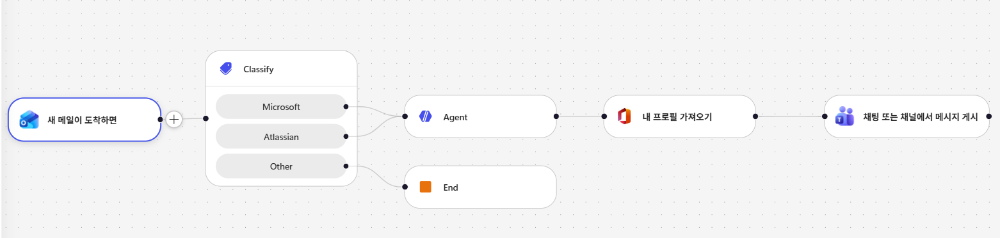
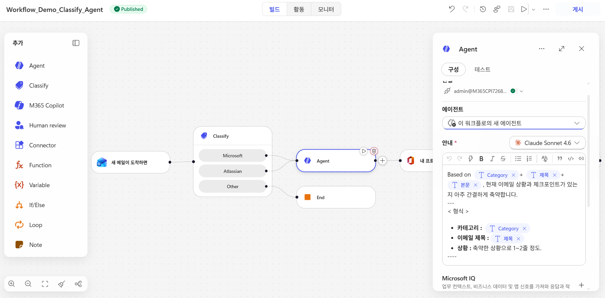
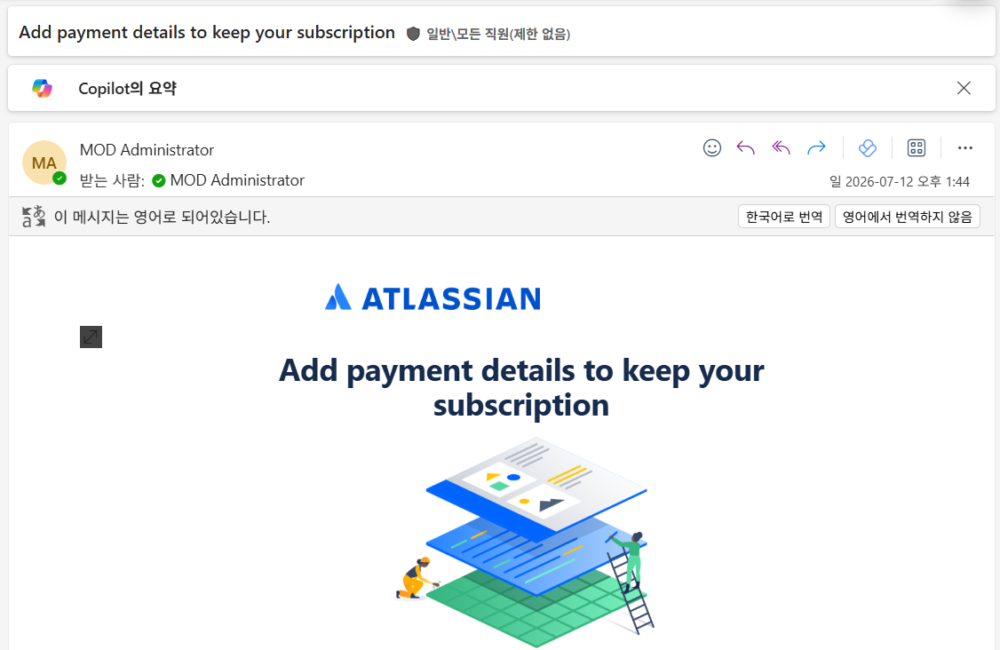
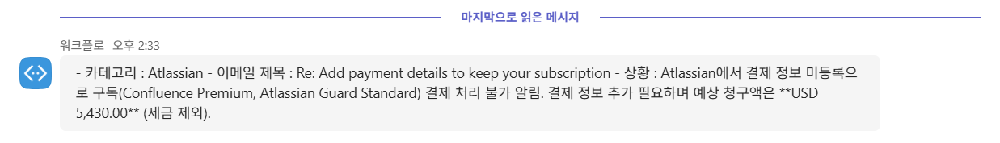

# Workflow

새 이메일이 도착하면, AI Classify를 통해 이메일을 분류하고, 분류된 이메일을 기반으로 현재 상황 및 위험을 Agent가 판단하고 작성하여 Teams Chat으로 알림을 보내는 Workflow입니다. 

 

 

테스트 이메일 - Atlassian에서 발송된 결제 관련 이메일 

 

사용자의 개인 Chat으로 해당 이메일의 위험을 판단한 결과를 전송함. 

