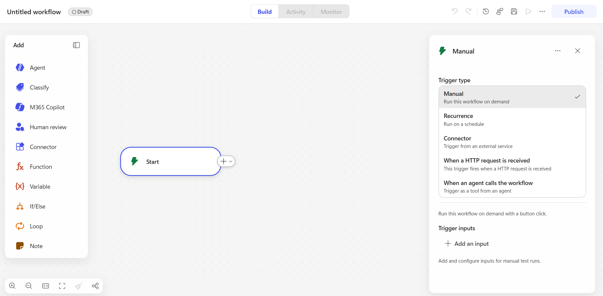
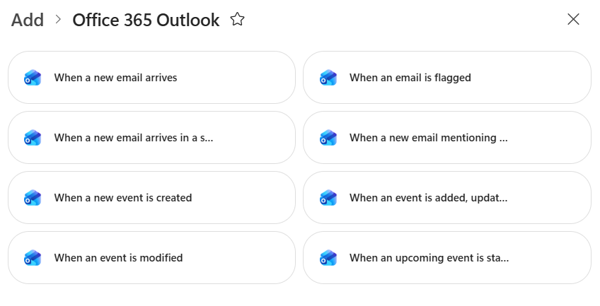
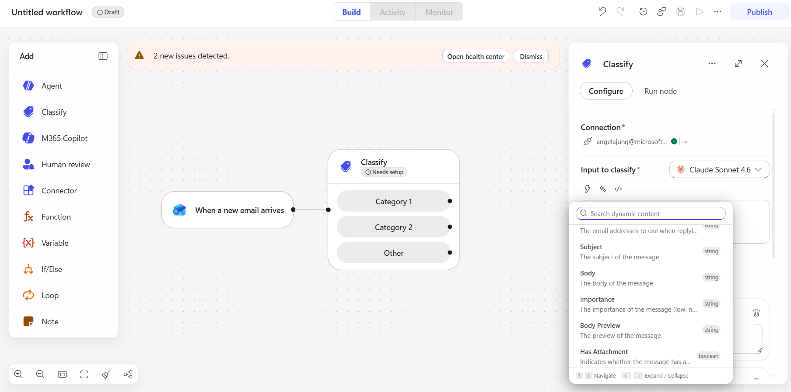
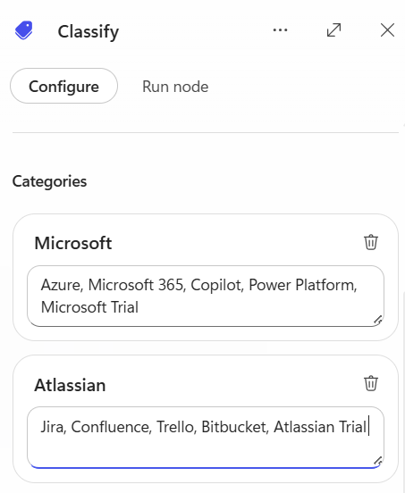
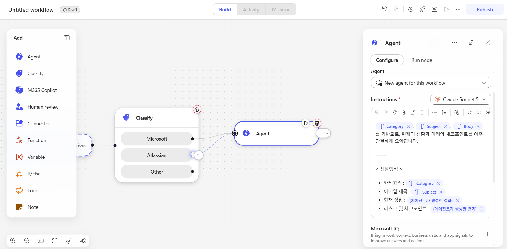
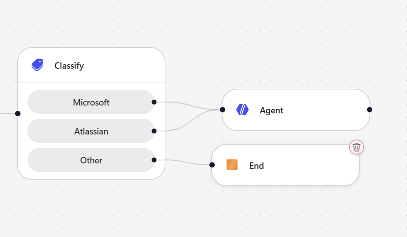
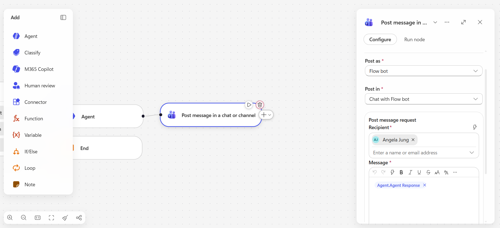
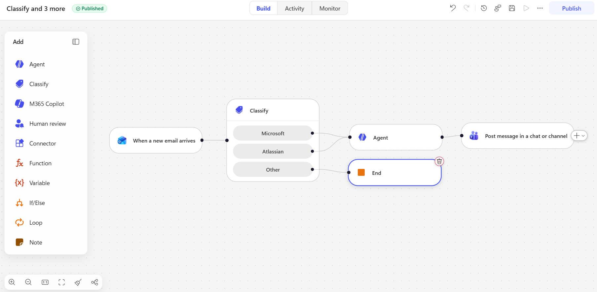
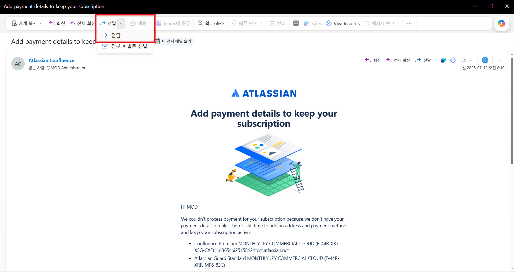
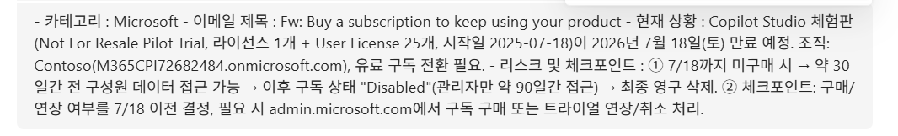

[실습용 eml 파일 다운로드 1]({{ '/workflow_downloads/atlassian_email.eml' | relative_url }})

[실습용 eml 파일 다운로드 2]({{ '/workflow_downloads/microsoft_email.eml' | relative_url }})

# Email 구분 Workflow 생성

## Trigger 설정 

새로운 Workflow를 생성하고, **Trigger Type을 Connector**로 변경합니다. 그리고 `Office 365 Outlook`의 `When a new email arrives` Connector를 연결합니다.

  


<br>

## Classify 활용 

workflow의 새로운 기능인 `Classify`를 활용하여, 이메일 제목과 본문 내용을 기반으로 이메일을 AI 기능을 통해 사전 정의된 카테고리로 분류해보겠습니다. 

**Input to classify (Input)** 부분의 Trigger Output인 `Subject`와 `Body`를 선택합니다. 



**Categories** 부분에는 이메일을 분류할 카테고리를 정의합니다. 예를 들어, `Atlassian`과 `Microsoft` 두 가지 카테고리를 정의합니다. 

각 카테고리 설명에는 아래와 같이 이메일 제목과 본문 내용에 포함될 수 있는 키워드 및 예제문을 작성합니다. 

- **Microsoft :** Azure, Microsoft 365, Copilot, Power Platform, Microsoft Trial (예시)

- **Atlassian :** Jira, Confluence, Trello, Bitbucket, Atlassian Trial (예시)



Other 항목은 자동 생성됩니다. 

<br>

## Inline Agent 생성 

Other 항목으로 분류되지 않은 이메일, 즉 Microsoft와 Atlassian 항목은 Inline Agent를 생성하여, 해당 이메일을 기반으로 현재 상황 및 risk point를 분석하도록 동적콘텐츠를 선택하고 지침을 작성합니다. 



### 지침 예시 

```text
[Category 동적 콘텐츠 선택], [Subject 동적 콘텐츠 선택], [Body 동적 콘텐츠 선택] 를 기반으로, 현재의 상황과 미래의 체크포인트를 아주 간결하게 축약합니다. 현재 상황과 리스크 및 체크포인트 항목을 길게 작성하지 않습니다.

------ 

< 전달형식 > 

카테고리 : [Category 동적 콘텐츠 선택]
이메일 제목 : [Subject 동적 콘텐츠 선택]
현재 상황 : {{에이전트가 생성한 결과}} 
리스크 및 체크포인트 : {{에이전트가 생성한 결과}}
```

이와 같이 해당 workflow를 위해 새로운 Inline Agent를 생성할 수도 있고, 기존에 **게시된** 에이전트를 선택하여 사용할 수도 있습니다. 

Agent를 완성했다면, **해당 에이전트 노드에서 길게 선을 빼내어 Atlassian 카테고리에도 연결합니다.**

### Tip 

New workflow에서는 AI Prompt (AI builder) 기능이 사라졌습니다! **해당 Agent 커넥터는 기존의 AI Prompt를 New experience에서 대체합니다.** 

<br>

## End 연결 

**Other** 항목으로 분류된 이메일은 추가의 Step 없이 해당 workflow를 종료하도록 **End**를 연결합니다. 



<br>

## Teams Connector 연결 

Microsoft Teams 커넥터의 Post message in a chat or channel 액션을 사용합니다. 사용자의 개인 Teams 채팅으로 Flow bot이 해당 알림을 보내도록 설정하겠습니다. 

- **Post as:** Flow bot  
- **Post in:** Chat with Flow bot 
- **Post message request Recipient:** 실습 대상자의 UPN 
- **Message:** [Agent.AgentResponse 동적 콘텐츠] 



<br>

## 전체 Workflow 

아래와 같이 workflow를 완성했습니다! 

  

------------------------------------------------

# Email 구분 Workflow 테스트 

위에서 다운로드 받은 eml 파일을 열어서, Outlook 앱에서 스스로에게 전달 (foward) 해봅니다. 



Workflow 윗쪽 탭의 Activity 란에서 해당 workflow의 Run 및 상세한 Input / Output을 관찰할 수 있습니다. 

Teams로 다음과 같이 workflow 혹은 flow bot 에게 메세지가 온다면, 성공입니다! 



> Teams 관리자가 Workflow App을 허용하지 않았다면, 해당 기능은 실습이 불가능합니다. 이 경우 Outlook 과 같이 대체 Connector를 연결하여 실습하세요. 

