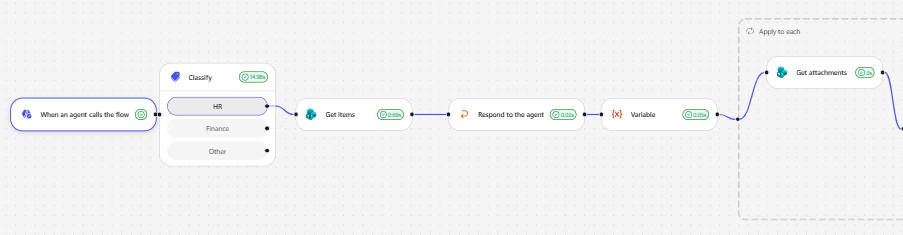
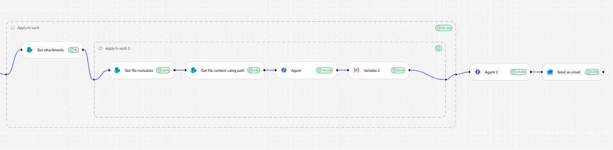
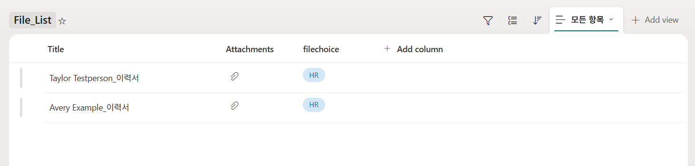
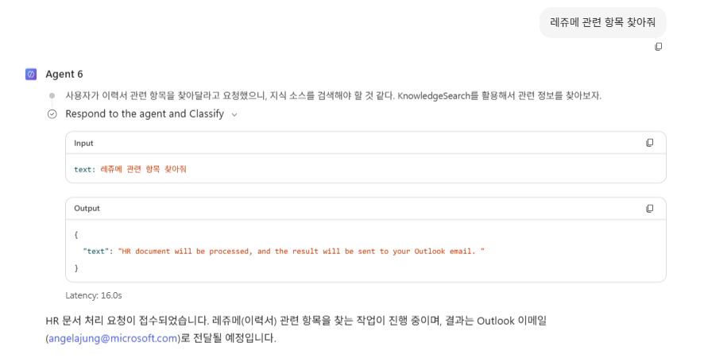
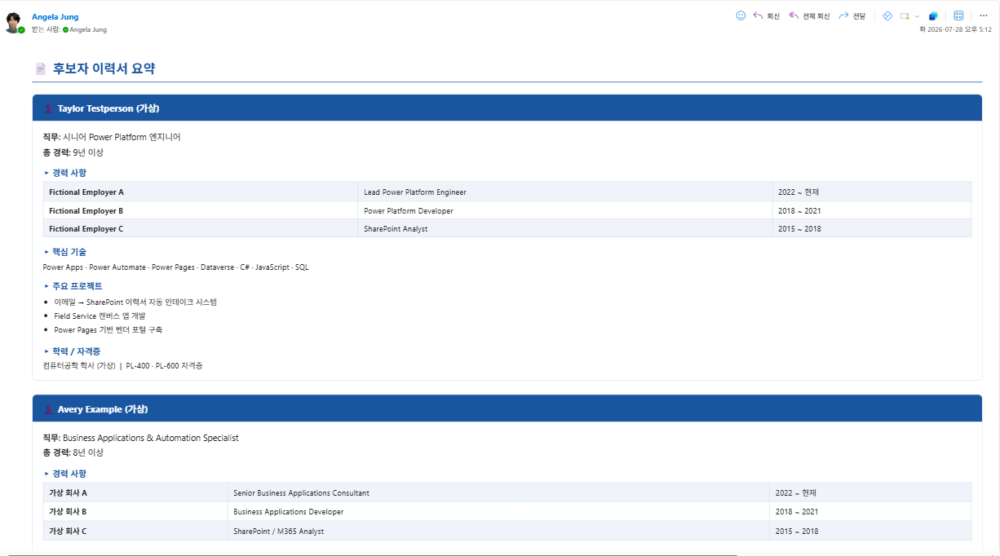

# 실습 2 - SharePoint List 첨부파일 조회 Workflow 

사용자의 발화에 맞추어 라우팅될 Choice를 결정하고, (예: 레쥬메 관련 항목을 조회해줘 일 경우 "HR" 카테고리로 Classify.) 해당 Choice가 있는 SharePoint List 항목의 Attachment 파일 콘텐츠를 불러와 인라인 에이전트에게 요약을 요청하는 Workflow 입니다. 

## SharePoint List 

아래와 같은 SharePoint List가 있습니다. 각 항목은 HR 이라는 카테고리가 있으며, 첨부파일이 존재합니다. 

## 에이전트에게 요청  

사용자는 에이전트에게 다음과 같이 요청하고, 조만간 정리된 이메일을 받는다는 답변을 받게 됩니다. 

## 최종 결과물 이메일 

SharePoint, Outlook Connector, Classify 기능, 총 두 개의 Agent 기능을 이용하여 각 항목에 있는 첨부파일을 요약하고, (Agent 1) 해당 요약된 내용을 보기 좋게 Email HTML화 시켜 (Agent 2) 사용자에게 전송합니다. 

